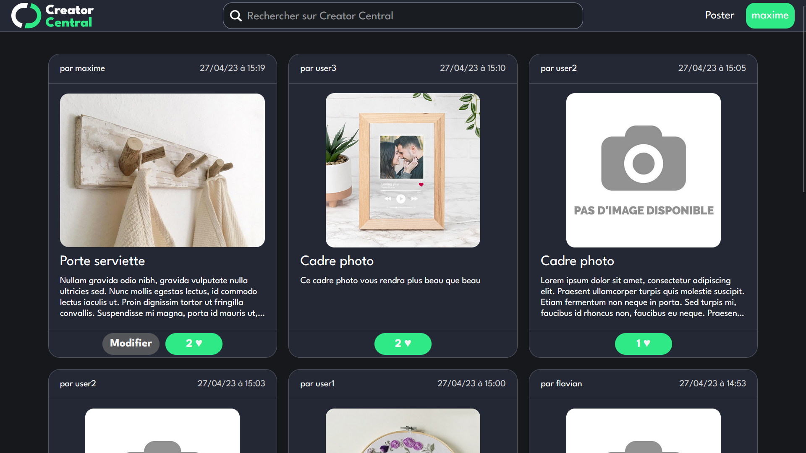
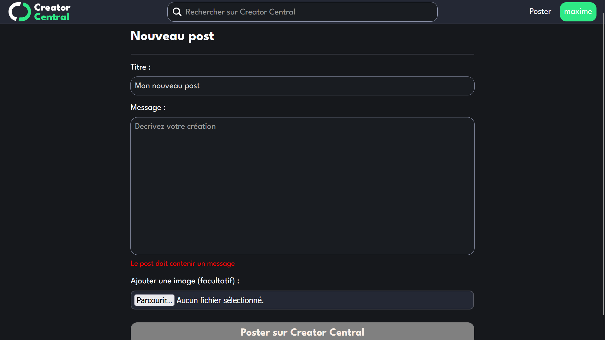

<a name="readme-top"></a>
<!-- CREDITS -->
<!--
*** README template by othneildrew : https://github.com/othneildrew/Best-README-Template/blob/master/README.md?plain=1
*** Programming language badges by Ileriayo : https://github.com/Ileriayo/markdown-badges
-->


<!-- PROJECT LOGO -->
<br />
<div align="center">
  <a href="https://github.com/maxime-bl/WE4A_CreatorCentral">
    
  </a>

  <h3 align="center">WE4A_CreatorCentral</h3>

  <p align="center">
    Projet scolaire de développement web 
  </p>
</div>

## Présentation

### Réalisé avec


### Aperçu du site

#### Page d'accueil:


#### Feed:


#### Formulaire de création de post:



## Installation

### Prérequis
- Le site a été développé avec **PHP 8.2.0** et **MariaDB 10.4.27**. L'utilisation de version antérieures peut entrainer des dysfonctionnements.
- Pour faire le tourner le site en local, nous recommandons d'utiliser XAMPP: https://www.apachefriends.org/download.html

### Installation avec XAMPP

1. Cloner le dépot dans le répertoire `htdocs` de XAMPP (par défaut `C:\xampp\htdocs`)
   ```sh
   git clone https://github.com/maxime-bl/WE4A_CreatorCentral.git C:\xampp\htdocs\creatorcentral
   ```
2. Créer la base de données dans phpMyAdmin grâce aux requêtes SQL dans le fichier [`creatorcentral.sql`](creatorcentral.sql)

3. Les identifiants par défaut pour la connexion à la base de donnée sont:
  - Utilisateur : **"root"**
  - Mot de passe : **""**
  - Il est possible de modifier ces identifants à partir de la **ligne 14** du fichier [`classes/SQLconn.php`](classes/SQLconn.php)
  
4. Après avoir lancé les serveurs Apache et MySQL de XAMMP, le site est accessible à l'adresse http://localhost/creatorcentral/


## Utilisation

Voici une liste des comptes présents dans la base de donnée :

Username / Mot de passe

- maxime / maxime12
- flavian / 12345678
- user1 / azerty01
- user2 / azerty02
- user3 / azerty03


## Contributeurs

- Maxime Blanchard - https://github.com/maxime-bl
- Flavian Theurel - https://github.com/heosfx

<p align="right">(<a href="#readme-top">Retour en haut</a>)</p>
